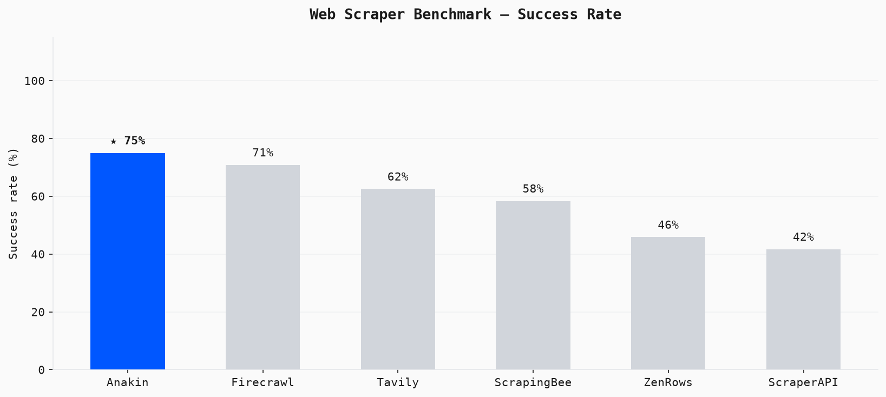
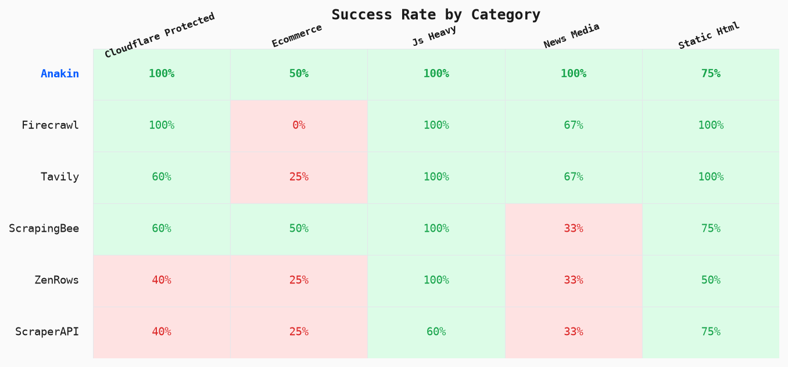
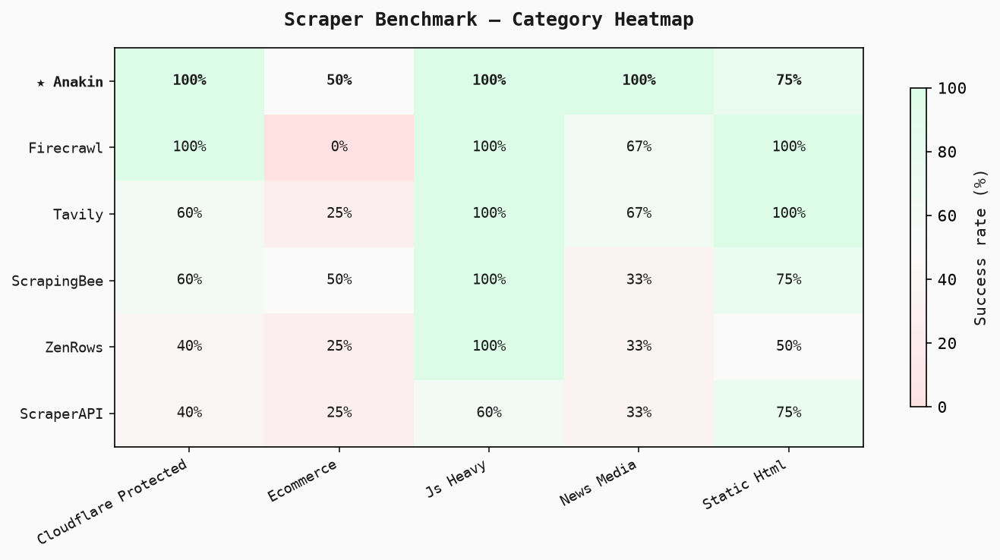

# Scraper Benchmark

**How does Anakin's URL Scraper stack up against the field?**

This repo benchmarks [Anakin's `/v1/scrape` endpoint](https://anakin.io) against six other web scraping APIs across 24 URLs — a mix of static pages, JS-heavy SPAs, Cloudflare-protected sites, Akamai-protected sites, e-commerce pages, and news/media.

You bring your own API keys. Plug them into `.env`, run one command, get a terminal table + CSV + charts.

## Scrapers tested

| Scraper | Endpoint | Notes |
|---|---|---|
| **Anakin** | `/v1/scrape` | Returns clean Markdown, handles JS + anti-bot natively |
| Firecrawl | `/v1/scrape` | YC-backed, Markdown output |
| ZenRows | `/v1/` | JS rendering + premium proxies |
| ScraperAPI | `/api/` | Proxy-based, returns raw HTML |
| Oxylabs | `/v1/queries` | Enterprise proxy network, returns raw HTML |
| ScrapingBee | `/api/v1/` | Acquired by Oxylabs Jun 2025, returns raw HTML |
| Tavily | `/extract` | Search-focused; uses their URL extraction endpoint |

## Metrics

| Metric | What it shows |
|---|---|
| **Success rate** | Did the scraper return real page content (not an error/bot block)? |
| **Response time (ms)** | Wall-clock time per request, successful requests only |
| **Raw bytes** | Size of what the scraper returned |
| **Markdown bytes** | Size of clean Markdown output (where supported) |
| **Content quality score** | 0–1 score: did the response contain expected content at meaningful length? |

## Official results

Pre-run results and charts are in [`results/official/`](results/official/). Re-run at any time with your own keys to verify.





## Quickstart

**Requirements:** Python 3.10+

```bash
git clone https://github.com/anakin-io/scraper-benchmark
cd scraper-benchmark

# Install dependencies
pip install .

# Set up your API keys
cp .env.example .env
# Edit .env — any scraper without a key is skipped automatically

# Run
python run_benchmark.py
```

Any scraper whose key is missing is skipped — you don't need all seven keys to run a useful benchmark.

## Options

```bash
# Run only specific scrapers
python run_benchmark.py --scrapers anakin firecrawl zenrows

# Adjust concurrency (default: 6 parallel requests)
python run_benchmark.py --concurrency 4

# Skip chart generation
python run_benchmark.py --no-plots

# Write results to a custom directory
python run_benchmark.py --results-dir my_results
```

## Output

Running the benchmark produces:

```
results/
├── results_2026-06-28_12-00-00.json   ← all raw results
├── results_2026-06-28_12-00-00.csv    ← spreadsheet-friendly
└── plots/
    ├── success_rate.png
    ├── response_time.png
    └── category_heatmap.png
```

To regenerate charts from an existing results file:

```bash
python scripts/generate_plots.py results/results_2026-06-28_12-00-00.json
```

## URL test set

Test URLs live in [`urls/test_urls.yaml`](urls/test_urls.yaml) — 24 URLs across six categories:

- **Static HTML** — baseline; all scrapers should pass
- **JS-heavy SPAs** — React/Next.js apps; requires headless rendering
- **Cloudflare-protected** — Cloudflare Bot Management
- **Akamai/PerimeterX-protected** — enterprise-grade bot detection
- **E-commerce** — dynamic pricing, personalised content, strong anti-bot
- **News/media** — CDN-served, some soft paywalls

Swap URLs or add your own in the YAML — the format is documented inline.

## How scoring works

Each URL × scraper result is scored by a judge (`benchmark/judge.py`):

1. **+0.5** — request succeeded and returned > 500 bytes
2. **+0.3** — response contains the expected content string for that URL
3. **+0.2** — response is > 1,000 bytes (non-trivial content returned)

A result **passes** if it has `success=True` and a quality score ≥ 0.5. This is deliberately simple and reproducible — no LLM judge, no subjective rubric.

## License

MIT
